# Telecom Billing Agentic AI

A multi-agent AI system for telecom billing inquiries, demonstrating enterprise-grade patterns with:
- **LangChain + LangGraph** for agent orchestration
- **Pinecone** for vector-based RAG (Retrieval-Augmented Generation)
- **OpenAI GPT** for language understanding and generation
- **Guardrails** for safe, verified responses
- **Session Memory** for context-aware conversations
- **Evaluation Framework** to benchmark RAG and Chunking strategies

> **Demo Project**: This uses mock data for demonstration purposes. Not for production use.

---

## What Does This System Do? (Architecture)

To fully understand the Agentic AI system, here are two views of the architecture:

### 1. Non-Technical View (The Customer Experience)
This view shows how a customer interacts with the system, highlighting how queries are intelligently routed to the correct specialized department.

```mermaid
graph TD
    %% Styling
    classDef user fill:#FF9F1C,stroke:#333,stroke-width:2px,color:#fff,font-weight:bold
    classDef app fill:#2EC4B6,stroke:#333,stroke-width:2px,color:#fff
    classDef router fill:#011627,stroke:#333,stroke-width:2px,color:#fff,shape:hexagon
    classDef agent fill:#43A047,stroke:#333,stroke-width:2px,color:#fff,shape:rect
    classDef manager fill:#E71D36,stroke:#333,stroke-width:2px,color:#fff,shape:rect

    User([👤 Customer]):::user --> App[📱 Telecom Assistant App]:::app
    App --> Router{{🔀 Smart Router}}:::router
    
    Router -- "General Questions\n(Plans, AT&T info)" --> Sales["💼 Sales Agent\n(Reads Wikipedia)"]:::agent
    Router -- "Specific Account Info\n(My Bill, Due Date)" --> Billing["📊 Billing Agent\n(Reads Customer PDFs)"]:::agent
    
    Sales --> User
    Billing --> QA["✅ Manager Agent\n(Verifies Answers & $ Amounts)"]:::manager
    
    QA --> User
```



### 2. Technical View (The Engineering Architecture)
This view details the data ingestion pipeline, the LangGraph multi-agent orchestration, and the persistent SQLite memory system.


---

## Quick Start (5 minutes)

### Prerequisites
- Python 3.11+
- OpenAI API key ([get one here](https://platform.openai.com/api-keys))
- Pinecone API key ([get one here](https://app.pinecone.io/))

### Step 1: Create Virtual Environment

```bash
# Create virtual environment
python -m venv venv

# Activate it
# Windows:
.\venv\Scripts\activate
# Mac/Linux:
source venv/bin/activate
```

### Step 2: Install Dependencies

```bash
pip install -r requirements.txt
```

### Step 3: Configure Environment

```bash
# Copy the example environment file
# Windows:
copy .env.example .env
# Mac/Linux:
cp .env.example .env

# Edit .env with your API keys:
# OPENAI_API_KEY=sk-your-key-here
# PINECONE_API_KEY=your-pinecone-key-here
```

### Step 4: Ingest Documents

```bash
# Ingest Customer PDFs into `telecom-docs` namespace
python -m app.ingest

# Ingest Wikipedia Articles (AT&T, 5G, etc.) into `telecom-wiki` namespace
python -m app.ingest_wiki
```

### Step 5: Run the System

```bash
# Single Question with Naive RAG (Default)
python -m app.cli "What is my bill for January 2026?"

# Single Question with HyDE RAG Strategy
python -m app.cli "What is my bill for January 2026?" --rag-strategy hyde

# Interactive mode (with session memory!)
python -m app.cli --interactive --rag-strategy hyde

# Ask SalesAgent a Wikipedia knowledge question
python -m app.cli "When was AT&T founded?"
```

---

## Advanced RAG Features

This project includes advanced RAG techniques and an evaluation framework to demonstrate how to optimize document retrieval and question answering.

### 1. RAG Strategies
You can switch RAG retrieval strategies dynamically using the `--rag-strategy` CLI flag:
- **Naive (Default)**: Directly embeds the user's query and searches for similar document chunks.
- **HyDE (Hypothetical Document Embeddings)**: Uses an LLM to generate a fake "hypothetical" answer first, then embeds that answer to find similar actual documents. (Proved to be the most effective in our evaluation).
- **Multi-Query**: Uses an LLM to generate 3 different phrasings of the user's query, retrieves documents for all 3 variations, and merges the results.

### 2. Chunking Strategies
The system includes multiple pluggable chunking strategies in `app/chunking/`:
- **Fixed-Size Chunking**: Splits text into fixed token windows with overlap (Default, best performer).
- **Recursive Character Chunking**: Uses LangChain's recursive splitter to break on paragraphs, then sentences, then words.
- **Semantic Chunking**: Uses OpenAI embeddings to detect semantic topic shifts and breaks chunks when topics change.

### 3. Evaluation Framework
Includes a full 3x3 matrix evaluation runner that tests all combinations of RAG strategies and Chunking strategies against a set of 10 diverse queries. It uses **LLM-as-a-judge** (simulating the RAGAS framework) to score:
- **Faithfulness**: Is the answer grounded in the retrieved context?
- **Relevancy**: Does it answer the question?
- **Correctness**: Does it match the ground truth?

Run the full 90-run evaluation (takes ~2 minutes):
```bash
python -m app.evaluation.eval_runner
```
*(Results are saved to `data/evaluation_results/`)*

---

## Project Structure

```
telecom-billing-agentic-ai/
|
+-- app/                          # Main application code
|   +-- config.py                 # Configuration & environment
|   +-- ingest.py                 # Customer PDF ingestion script
|   +-- ingest_wiki.py            # Wikipedia knowledge ingestion script
|   +-- cli.py                    # Command-line interface
|   +-- graph.py                  # LangGraph workflow definition
|   |
|   +-- agents/                   # Agent implementations
|   |   +-- sales.py              # SalesAgent (general knowledge + Wiki RAG)
|   |   +-- billing.py            # BillingAgent (Customer docs RAG)
|   |   +-- manager.py            # ManagerAgent (validator)
|   |
|   +-- chunking/                 # Pluggable Chunking Strategies
|   |   +-- fixed_size.py
|   |   +-- recursive.py
|   |   +-- semantic.py
|   |
|   +-- evaluation/               # Evaluation Framework
|   |   +-- eval_runner.py        # 3x3 evaluation matrix runner
|   |   +-- report.py             # Evaluation report generator
|   |
|   +-- memory/                   # Session & Entity Memory
|   |
|   +-- rag/                      # RAG components
|   |   +-- pdf_loader.py         # PDF parsing with pdfplumber
|   |   +-- pinecone_store.py     # Pinecone vector DB wrapper
|   |   +-- retriever.py          # Multi-namespace retrieval logic
|   |
|   +-- utils/                    # Utilities (Guardrails, logging)
|
+-- data/
|   +-- docs/customer_pdfs/       # Demo customer PDF documents
|   +-- eval_queries.txt          # 10 queries + ground truth for evaluation
|   +-- evaluation_results/       # Output directory for eval reports
|
+-- scripts/
|   +-- convert_to_pdf.py         # Utility to convert txt to PDF
|
+-- requirements.txt              # Python dependencies
+-- README.md                     # This file
```

---

## Architecture Decisions

### Why LangGraph (not just LangChain)?
- LangChain = building blocks for LLM apps
- LangGraph = **stateful workflows** with conditional routing
- Our flow requires: Router → Agent → Manager → Response (with state)

### Why Pinecone Namespaces?
- We separate data into namespaces (`telecom-docs` for customer data, `telecom-wiki` for knowledge base, and `eval-*` for chunking evaluations).
- Allows precise control over what data each Agent can access (e.g. SalesAgent only searches Wikipedia).

### Evaluation Learnings
Through our evaluation framework, we discovered:
1. **Fixed-Size Chunking** preserves complete document context better than Semantic or Recursive chunking for these types of highly structured telecom billing PDF documents.
2. **HyDE (Hypothetical Document Embeddings)** yields the most accurate retrieval because the generated hypothetical answer closely matches the dense terminology found in actual billing documents.

---

## License

MIT License - This is a demo/educational project.

---

## Acknowledgments

Built with:
- [LangChain](https://langchain.com/) - LLM application framework
- [LangGraph](https://langchain-ai.github.io/langgraph/) - Agent orchestration
- [Pinecone](https://pinecone.io/) - Vector database
- [OpenAI](https://openai.com/) - LLM and embeddings
- [RAGAS Concepts](https://docs.ragas.io/en/stable/) - Inspire the LLM-as-a-judge evaluation
